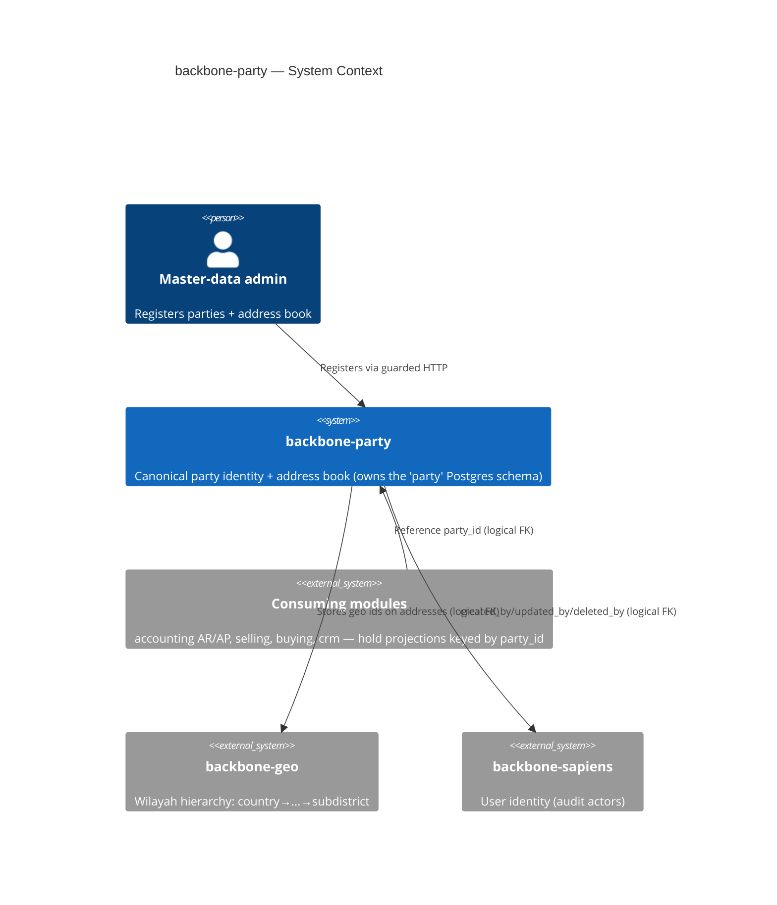
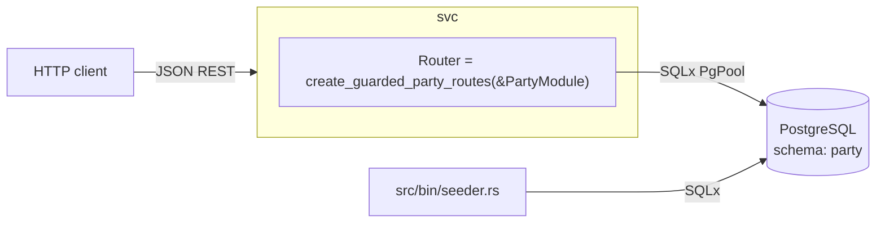
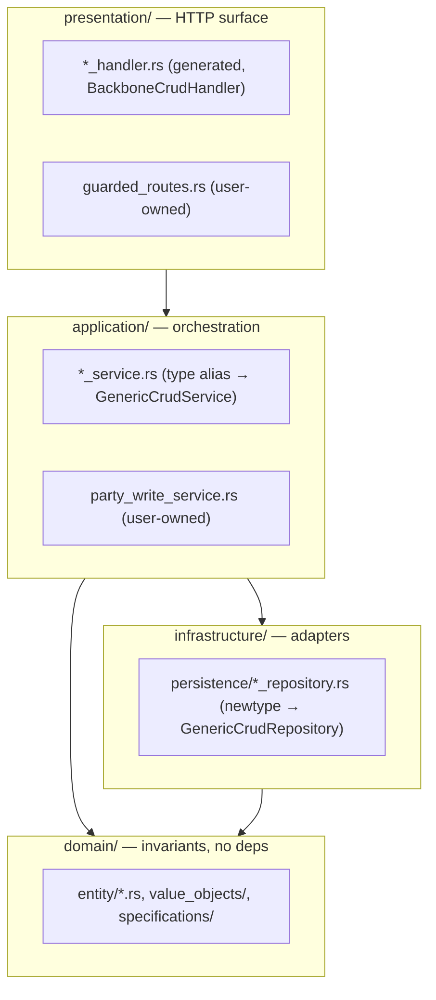

<!-- Reader: Maintainer · Mode: Explanation -->
# Architecture

`backbone-party` is a **library crate** (no `main.rs`) that owns one bounded context: the canonical
Party identity and its address book. A `backend-service` composes it by calling
`PartyModule::builder()` and mounting its routes. Most of the crate is generated from
`schema/models/*.model.yaml`; the hand-written parts are a small, named set. This page is the map a
new maintainer needs before editing.

## 1. Context

Who uses the module and what it (logically) depends on. **No arrow here is a Cargo dependency or a
cross-schema DB constraint** — the outbound ones are *logical FKs* validated elsewhere.



*What to notice: every dependency is logical. The module compiles and tests with none of these
siblings present — the only `external_imports` entry ([`index.model.yaml`](../schema/models/index.model.yaml))
is `sapiens.User`, and even that is a reference, not a constraint.*

## 2. Containers

The module is not deployed on its own — it is linked into a host service. The runnable pieces:



*What to notice: the module contributes a `Router` and a set of services over a shared `PgPool`; the
host owns the socket, the pool, and (in production) the auth layer wrapped around the router.*

### Two mounting surfaces — pick deliberately

| Surface | Function | What it mounts | Use when |
|---------|----------|----------------|----------|
| **Guarded (recommended)** | `create_guarded_party_routes(&PartyModule)` | Read routes for all 5 entities **+ validated `POST` create** via `PartyWriteService` + `POST /party-set-primary` | Any real deployment |
| **Full / unguarded** | `PartyModule::all_crud_routes()` | All 12 generated CRUD endpoints per entity, **no domain validation** | Trusted admin / seeding only |
| ~~`routes()`~~ | `#[deprecated]` alias of `all_crud_routes()` | same as above | never — exists only to make the naive call fail loudly |

The guarded surface exists because the generated CRUD writes rows with no domain validation — a
well-formed request could create an incoherent party or a second primary. See
[ADR-002](adr/ADR-002-data-integrity-invariants.md).

## 3. Components — the DDD 4-layer shape

Dependencies point **inward only**. Domain knows nothing of Axum or SQLx.



| Layer | Holds (for party) | May depend on | Generated? |
|-------|-------------------|---------------|-----------|
| **Domain** | `Party`, `PartyAddress/Contact/Email/Phone`, enums (`PartyKind`, `PartyStatus`, `AddressType`), `Metadata` value object, specifications | nothing | ✅ generated |
| **Application** | Service type aliases over `GenericCrudService`; `PartyWriteService` (validated writes) | domain | services generated · `party_write_service.rs` **hand-written** |
| **Infrastructure** | Repository newtypes over `GenericCrudRepository<E, PgPool>` | domain | ✅ generated |
| **Presentation** | `BackboneCrudHandler` wiring (12 endpoints/entity); `guarded_routes.rs` composition | application | handlers generated · `guarded_routes.rs` **hand-written** |

The composition root is **`src/lib.rs`** — it declares `PartyModule`, its builder, `all_crud_routes()`,
and the `#[deprecated] routes()` alias, and re-exports the custom write API inside `// <<< CUSTOM`
markers.

> ⚠️ **Drift note (verified 2026-07-02):** `src/module.rs` is a **stale skeleton** (`Module` /
> `Example`) left from the module template and is **not** declared in `lib.rs` — it is dead code. The
> real composition root is `lib.rs`. Do not edit `module.rs`; treat `lib.rs` as authoritative. (Flagged
> for cleanup in the coverage report.)

## 4. Data & control flow — `POST /parties`, traced

The one operation worth tracing: a validated party create through the guarded surface.

```mermaid
sequenceDiagram
    actor Admin
    participant R as Axum Router (guarded_routes)
    participant W as PartyWriteService
    participant PG as PostgreSQL (party schema)
    Admin->>R: POST /parties {partyCode, partyKind, name, npwp?, nik?, …}
    R->>W: create_party(NewParty)
    W->>W: validate_npwp / validate_nik (digit count)
    W->>W: kind/field coherence (person needs name part; org needs legal_name, no NIK)
    W->>PG: INSERT INTO party.parties (…)
    alt unique violation (party_code / npwp / nik)
        PG-->>W: 23505
        W-->>R: PartyWriteError::Duplicate*
        R-->>Admin: 422 {error, message}
    else ok
        PG-->>W: row
        W-->>R: Ok(id)
        R-->>Admin: 201 {id}
    end
```

*What to notice: validation happens in `PartyWriteService` **before** the INSERT, and DB unique
violations are mapped back to typed `422` errors — the two layers of the same invariant (service +
DB constraint) both hold. The generated CRUD handler (`create_party_routes`) skips the
`PartyWriteService` step entirely, which is exactly why it is not mounted in production.*

The full rule set (R1–R8) lives in [`schema/hooks/party.hook.yaml`](../schema/hooks/party.hook.yaml);
the numeric oracle is [`tests/party_golden_cases.rs`](../tests/party_golden_cases.rs).

## 5. The stack, and why

| Choice | Why | Rejected alternative |
|--------|-----|----------------------|
| **Rust 2021, `[lib]` only** | A module is a library linked into a service; it must not own a `main` | Standalone microservice per domain (deployment sprawl) |
| **Axum 0.7 + Tower** | Router composition — the module hands back a `Router` the host merges | Actix (harder to compose as a sub-router) |
| **SQLx 0.8 / PostgreSQL** | Compile-time-checked queries; a dedicated `party` schema per module | An ORM that hides SQL (loses the schema-per-module boundary) |
| **Tokio 1.x** | Async runtime the framework standardizes on | — |
| **`thiserror` (domain) / `anyhow` (wiring)** | Typed domain errors (`PartyWriteError`) map cleanly to HTTP status | Stringly-typed errors (lose the `code()`/`http_status()` mapping) |
| **Generated code from schema YAML** | One SSoT → entity, DTO, migration, repo, service, handler stay in lockstep | Hand-writing each layer (drift, and 12 CRUD endpoints × 5 entities of boilerplate) |

Feature flags in [`Cargo.toml`](../Cargo.toml) (`events`, `auth`, `grpc`, `openapi`, `validation`)
gate optional layers; the module builds green with `default = []`.

## Key decisions

- [ADR-001 — the party bounded context](adr/ADR-001-party-boundary.md): identity-only, roles as
  projections, logical-FK decoupling, Indonesia-first, dedicated Postgres schema.
- [ADR-002 — data-integrity invariants](adr/ADR-002-data-integrity-invariants.md): one-primary-per-party
  (partial-unique index), person/organization coherence at create, switchable primary.
