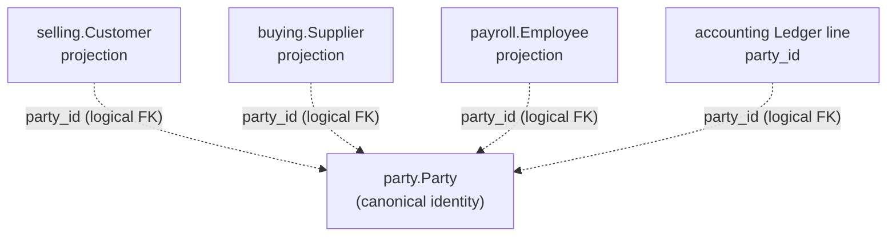

<!-- Reader: Evaluator · Mode: Explanation -->
# Philosophy & Motivation

**One idea:** there is exactly one answer to *"who is this party?"* in the whole ERP, and it lives
here. Everything else about this module falls out of protecting that sentence.

If you are deciding whether to adopt or extend `backbone-party`, read this page and
[the PRD](prd.md). If you then want the *why-not-otherwise*, the two [ADRs](adr/) carry the load.

## The problem

Accounting AR/AP, selling, buying, and CRM all need a stable identity for the counterparties they
transact with. The tempting shortcut — the one ERPNext takes — is to model `Customer` and `Supplier`
as near-duplicate master records, then cross-link them with hacks when the same real-world entity is
both. That overloading metastasizes: a "supplier who is also a customer and an employee" becomes
three records nobody can reconcile, and `party_id` means something different in every table.

`backbone-accounting` had already committed to the right shape — its ledger lines carry `party_id`
as a logical FK to a `party.Party` that must exist. This module is that anchor.

## The worldview (four commitments)

Each commitment is a line you can hold a change request against. If a proposed feature violates one,
it belongs in another module.

1. **Identity, not roles.** A Party is a *person or an organization* — nothing more. There is no
   `is_customer` / `is_supplier` / `is_employee` flag. See §"Roles are projections" below. This is
   the load-bearing decision; [ADR-001](adr/ADR-001-party-boundary.md) records it.
2. **Roles are projections.** Being a customer *is* having a `selling.Customer` row that references
   your `party_id`; supplier is `buying.Supplier`; employee is payroll. Each projection is owned by
   its context and holds only the fields that context needs. Party never learns they exist.
3. **Decouple by logical FK, never by a Cargo edge or a cross-schema DB constraint.** Party owns the
   `party` Postgres schema. Consumers reference `party.Party.id`; addresses reference `backbone-geo`
   ids — all as *logical* FKs (`@exclude_from_foreign_key_check`), validated at the consumer's ACL
   layer, never joined across schemas from here. The module has **zero horizontal Cargo
   dependencies** on sibling domain modules.
4. **The schema YAML is the source of truth.** The entity struct, DTOs, migration, repository,
   service, handler, and routes are *generated* from `schema/models/*.model.yaml`. Hand-written code
   lives only in `// <<< CUSTOM` markers or `user_owned` files. You change behavior by changing the
   schema, not by editing `.rs`.

### Roles are projections — the picture

*What to notice: every arrow points **into** Party and none point out. Party has no idea who
projects it. Removing `selling` cannot break `party`.*

## Indonesia-first

This is not a generic address book that happens to run in Indonesia. Statutory identity is
first-class: **NPWP** (tax ID, 15 legacy / 16 NIK-based digits) and **NIK** (national ID, 16 digits)
are validated, unique, and coherence-checked (an organization may not carry a NIK). Addresses
resolve to the Indonesian *wilayah* hierarchy through `backbone-geo` ids
(country → province → city → district → subdistrict). Postal code is *kode pos*. The
[glossary](glossary.md) defines each term.

## What we borrowed, and what we rejected

Good docs credit prior art instead of strawmanning it.

| Source | What we took | What we rejected |
|--------|--------------|------------------|
| **ERPNext** | The instinct that AR/AP need a party master | Its `Customer`/`Supplier` **as** the master — the duplication and cross-link hacks |
| **`salt-laravel-contacts`** (VINSTEKNIK) | The multi-channel decomposition: N addresses / emails / phones / contacts per entity | Its framing as a *personal* address book — we reframed it as an ERP party |
| **DDD / clean architecture** | The 4-layer split and dependency direction (domain depends on nothing) | Hand-rolling each layer — the generator writes the boilerplate; you write only invariants |

## Non-goals (what this module deliberately will not do)

Stating the boundary is what keeps the module small. None of the following belong here — each has an
owner:

- **Customer / Supplier / Employee facets** → `selling` / `buying` / payroll (projections).
- **Lead / Prospect** → `backbone-crm`. A Lead is *not* a Party; conversion is an explicit ACL step
  that mints one.
- **Pricing, credit terms, loyalty** → the consuming context.
- **The geo hierarchy itself** → `backbone-geo`. Party stores geo ids opaquely.
- **Per-company scoping, NPWP/NIK checksum, projection-event publishing** → parked; see
  [ADR-002 "Residual"](adr/ADR-002-data-integrity-invariants.md) for the honest list of what is
  *declared but not yet built*.

## Why trust it today

The maturity of the boundary has been stress-tested, not just asserted:

- The **CRUD-bypass is sealed** — generic unvalidated writes are not mounted in the recommended
  (guarded) composition; the full surface is opt-in and the naive `routes()` alias is
  `#[deprecated]`.
- Three **data-integrity invariants** (one-primary-per-party, person/organization coherence,
  statutory-ID uniqueness) are enforced at the DB *and* service layer, with route-level probes that
  fail if a broken state becomes legal ([ADR-002](adr/ADR-002-data-integrity-invariants.md)).
- The claims above are executable: [`tests/party_golden_cases.rs`](../tests/party_golden_cases.rs)
  and [`tests/integrity_probes.rs`](../tests/integrity_probes.rs) are the oracle.

Next: the [Architecture](architecture.md) if you'll maintain it, or the
[Developer guide](developer-guide.md) if you'll build on it.
